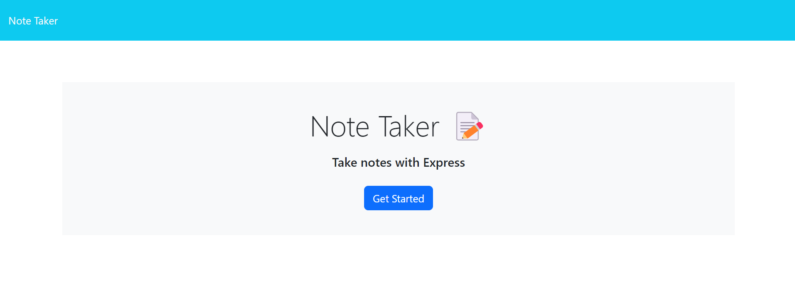
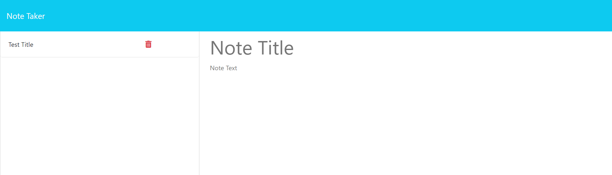
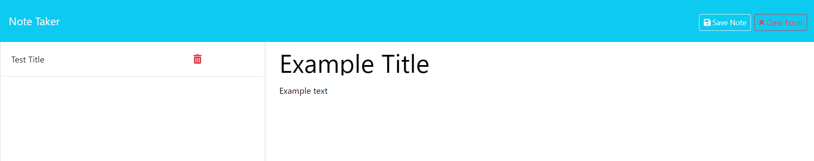

<div align='center'>
  
# Second Brain: Note Taker

[](https://opensource.org/licenses/MIT)

</div>

## Description

In a fast-paced lifestyle where one is flooded with many different situations and tasks to complete, keeping track of all your thoughts and tasks can be a challenge. This project aims to provide the user with a note-taking webpage or a second brain, if you will, to help them keep track of everything that pops up.

## Usage

To open the webpage, click this link here to go directly!

[Second Brain: Note Taker](https://second-brain-4ay7.onrender.com)

_OR_ Copy this link to paste it into a browser.

```md
https://second-brain-4ay7.onrender.com
```



Once you click on the provided link, the webpage shown above will appear (albeit slowly). Press the 'Get Started' button in the middle to proceed to the notes page.



After pressing the button, the page shown above will appear. Click on the areas labled 'Note Title' and 'Note Text' to input the title and text of the desired note to be inputted.



Once the text areas are filled, the 'Clear' and 'Save' options will appear. 'Clear' will empty the text areas, while 'Save' will save the inputted texts and generate it on the left side of the screen. The user can then click on the small red trash can icon on the left (adjacent to the note they wish to delete) to remove that specific note.

## Credits

This project wouldn't have been completed without the aid of demonstrations and assignments provided by the UCI Bootcamp teaching staff. Moreover, this project wouldn't have been possible without the starter code provided by staff under the project title miniature-eureka. The Github repository can be found [here](https://github.com/coding-boot-camp/miniature-eureka.git).

## License

MIT License
